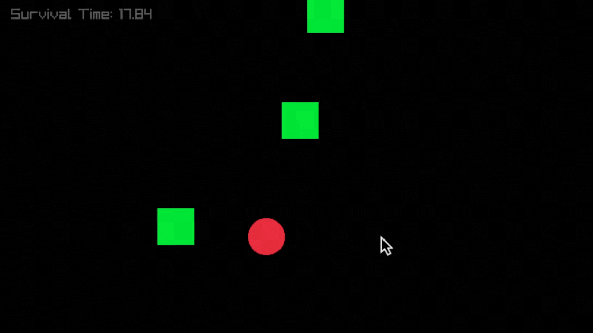

# 🟩 Square Dodge - A 2D Survival Game in C++

A minimal yet addictive 2D survival game made with [Raylib](https://www.raylib.com/) in C++. Control a red ball using arrow keys and dodge randomly bouncing green squares for as long as you can!

 <!-- Replace with actual gif path -->

---

## 🎮 Features

- 🌀 Smooth LERP-based red ball movement
- 🟩 Randomly moving green squares with wall bounce
- ⏱ Live survival time display
- 🔁 Press `R` to restart after game over
- 📦 Struct-based enemy logic for multiple squares
- 🧠 Frame-based logic with random direction changes
- 🎯 Collision detection between the player and moving squares

---

## 🔧 Installation

### Option 1: Using `vcpkg` (recommended)

```bash
# Clone and set up vcpkg
git clone https://github.com/microsoft/vcpkg
cd vcpkg
./bootstrap-vcpkg.sh  # or .\bootstrap-vcpkg.bat on Windows
```
# Install raylib
```bash
./vcpkg install raylib
```
# Compile:
```bash
g++ -std=c++17 main.cpp -o square_dodge -I/path/to/vcpkg/installed/include -L/path/to/vcpkg/installed/lib -lraylib
./square_dodge

```

# Option 2: Manual Setup
1. Download `raylib.h` and `libraylib.a` for your platform.
2. Place both files in your project directory.

# Compile like this: 

```bash
g++ -std=c++17 axe_game_update.cpp -o axe_game_update -I. libraylib.a -lopengl32 -lgdi32 -lwinmm
./axe_game_update
```